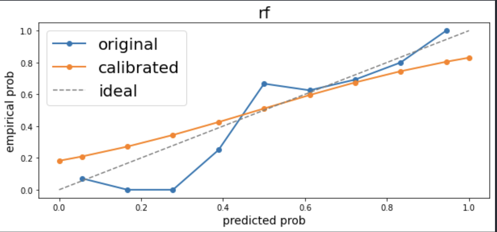
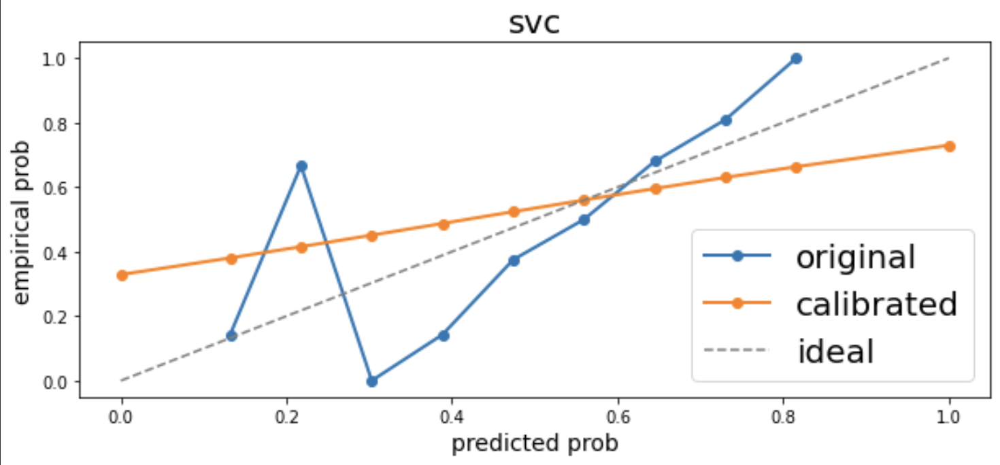

# 📊 Calibration Curve

Calibration Curve is an advanced concept in machine learning that allows to improve the performance of classifier even after they have been already trained.

The issue is that a trained classifier is uncalibrated, meaning that it is overconfident or underconfident in some regions. 

The calibration of probabilities allows us to transform the predicted probabilities of a model into a probability distribution that matches the empirical distribution of the target variable.

In other words we chain a new model to the trained model that predicts calibrated probabilities.

### A very concrete example:

Let's imagine our model has a cholesterol of 235 as input feature, and predicts a probability of 0.78 of having cardiovascular issues.
Let's imagine that this patient really has cardiovascular issues, and that our model has a threshold of 0.5. So in this case our model outputs a correct prediction (0.78 > 0.5).

**However**:

The model is over confident because only 69% of the population having a similar cholesterol have a heart disease. 
This is exactly the phenomenon of overconfidence/underconfidence that we are trying to calibrate.

# 🎇 Demo

## Random Forest

We can clearly see that after calibration, the probabilities are much closer to the empirical distribution we are aiming for.

Same phenomenon.

## SVC (Support Vector Classifier)

# ➡️ Conclusion:

Curve Calibration is often the last step in the fine tuning of a model, but it can significantly improve the quality of predictions, and hence should not be overlooked!

# 🙋🏻‍♂️ Authors

- [@Francois Porcher](https://github.com/FrancoisPorcher)

## 🔗 Links

